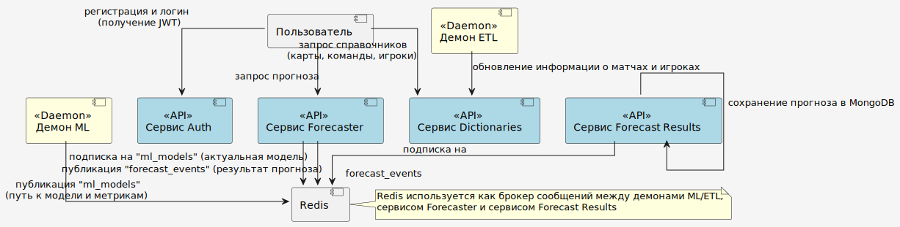

# CS2 система прогнозирования турнирных игр

# 🔄 Логика работы системы

Система работает как **цепочка микросервисов и фоновых демонов**, которые обмениваются данными и событиями через **Redis**, обеспечивая непрерывный цикл:  
**обновление данных → обучение моделей → прогнозирование → хранение результатов**.  

Главная цель — **предсказать вероятность победы команд в матче CS2** на основе карты, состава игроков и статистики предыдущих игр.

---

## 🧩 Общая структура

- **Пользователь** взаимодействует только с API-сервисами: `Auth`, `Dictionaries`, `Forecaster`.  
- **Демоны** (`ETL`, `ML`) работают в фоне и не имеют прямого пользовательского API.  
- **Redis** используется как брокер сообщений между сервисами, обеспечивая асинхронное взаимодействие.  
- **MongoDB** и **PostgreSQL** служат хранилищами данных и результатов.

---

## 1. 🧑 Регистрация и аутентификация (Auth Service)

Пользователь начинает работу с системой через сервис **Auth**:

- Регистрируется (создание учётной записи).  
- Входит в систему, получая **JWT-токен**.  
- Все дальнейшие запросы проходят с авторизацией через этот токен.  

Сервис хранит пользователей в **PostgreSQL** и управляет сессиями и токенами.

---

## 2. 🗺 Получение справочной информации (Dictionaries Service)

После входа пользователь обращается к сервису **Dictionaries**, чтобы выбрать:

- карту (например, *Inferno*, *Mirage*);  
- команды (*Team A*, *Team B*);  
- игроков каждой команды.  

Сервис возвращает актуальные данные из PostgreSQL, где хранятся справочники карт, команд и игроков.  
Эти данные обновляются автоматически демоном **ETL**.

---

## 3. 🧩 Обновление данных (ETL Daemon)

Фоновый **ETL демон** отвечает за регулярное обновление данных в системе:

- извлекает информацию из внешних источников (результаты матчей, статистика игроков);  
- очищает и подготавливает её для обучения моделей;  
- обновляет данные в сервисе **Dictionaries** через его API.  

Благодаря этому пользователи и ML демон всегда работают с актуальной статистикой.

---

## 4. 🤖 Обучение моделей (ML Daemon)

**ML демон** отвечает за создание и обновление моделей машинного обучения:

- Загружает свежие данные из БД.  
- Формирует набор признаков (features) — статистика команд, игроков и карт.  
- Обучает модель (например, RandomForest, Logistic Regression).  
- Сохраняет модель и метрики качества в виде файлов.  
- Публикует сообщение в **Redis** канал `"ml_models"` с путями к:
  - файлу модели,  
  - файлу метрик.  

> ⚙️ ML демон **не взаимодействует напрямую с базой данных** — он уведомляет о новых моделях через Redis.

---

## 5. 📈 Прогнозирование (Forecaster Service)

Сервис **Forecaster** предоставляет API для расчёта вероятности победы команд:

- Подписан на канал `"ml_models"` в Redis.  
- При публикации новой модели от ML — загружает её в память.  
- При получении пользовательского запроса (`map_id`, `team1_id`, `team2_id`, `player_ids`) выполняет:
  1. Формирование признаков.  
  2. Прогноз с использованием текущей ML-модели.  
  3. Возврат вероятностей победы команд.  
- Публикует событие прогноза в Redis канал `"forecast_events"`.  
- Сохраняет информацию о модели и метриках в PostgreSQL через `MLResultsRepository`.

---

## 6. 🗃 Хранение истории прогнозов (Forecast Results Service)

Сервис **Forecast Results** слушает Redis канал `"forecast_events"`.  
Он получает все прогнозы, опубликованные Forecaster, и сохраняет их в **MongoDB** для дальнейшего анализа.  

Эта история используется для:
- оценки качества модели,  
- анализа пользовательских запросов

---

## 7. ⚙️ Взаимодействие компонентов через Redis

**Redis** является центральным звеном асинхронного взаимодействия:

- **ML → Redis → Forecaster**: публикация новых моделей.  
- **Forecaster → Redis → Forecast Results**: публикация прогнозов.  

Такой подход обеспечивает:
- слабую связанность микросервисов,  
- устойчивость при сбоях,  
- возможность горизонтального масштабирования.

---

## 🧭 Краткий сценарий "от пользователя к прогнозу"

1. 👤 Пользователь → **Auth**: регистрация и вход, получение JWT.  
2. 🗺 Пользователь → **Dictionaries**: получает список карт, команд и игроков.  
3. 📡 Пользователь → **Forecaster**: отправляет запрос прогноза.  
4. ⚙️ **Forecaster** → использует актуальную модель из Redis (от ML).  
5. 🔁 **Forecaster** → публикует прогноз в Redis (`forecast_events`).  
6. 💾 **Forecast Results** → сохраняет событие в MongoDB.  
7. 🧩 **ETL** и **ML** демоны работают в фоне, обновляя данные и модели.

---

## ⚙️ Используемые технологии

| Компонент | Технологии и библиотеки |
|------------|--------------------------|
| **API-сервисы (Auth, Dictionaries, Forecaster)** | 🐍 **FastAPI**, **Pydantic**, **AsyncIO** |
| **Асинхронные БД-драйверы** | 🐘 **asyncpg** (PostgreSQL), **motor** (MongoDB) |
| **Фоновые процессы и обмен событиями** | 🔁 **Redis** (Pub/Sub), **AsyncIO** |
| **Машинное обучение** | 🤖 **scikit-learn**, **numpy**, **pandas**, **joblib** |
| **Хранилища данных** | 🗄️ **PostgreSQL**, **MongoDB** |
| **Миграции** | 🧱 **yoyo-migrations** |
| **Тестирование и качество кода** | ✅ **pytest**, **ruff**, **isort**, **autoflake** |

---

📘 Система построена на принципах **микросервисной архитектуры**, обеспечивает **масштабируемость**, **устойчивость к сбоям** и **возможность непрерывного обновления моделей машинного обучения**.
