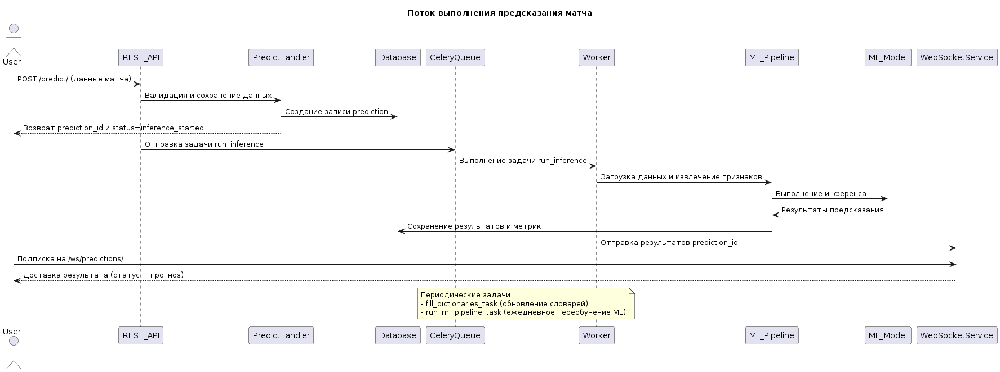

# Система предсказания исходов матчей

## Краткий обзор

Система обрабатывает данные о матчах, командах и игроках, запускает ML-модели для предсказаний и доставляет результаты пользователю в реальном времени.  
Используются: Django + DRF (REST), Django Channels (WebSocket), Celery (асинхронные задачи).

---

## Логика работы системы

1. **Постановка задачи**
   - Пользователь отправляет **POST-запрос** на `/predict/` с информацией о матче:
     - карты, команды, состав игроков.
   - `PredictHandler` проверяет данные через сериализатор и сохраняет запись предсказания в базе.
   - Система возвращает `prediction_id` и статус `inference_started`.

2. **Асинхронная обработка**
   - Задача на предсказание (`run_inference`) отправляется в очередь Celery.
   - Celery-воркер запускает ML-пайплайн:
     - загрузка данных,
     - извлечение признаков,
     - выполнение инференса модели,
     - сохранение результатов в БД и файлы метрик.

3. **Доставка результатов**
   - Клиент подписывается на WebSocket `/ws/predictions/`.
   - Когда ML-предсказание готово, система отправляет сообщение по WebSocket с:
     - статусом выполнения,
     - результатами предсказания (вероятности победы команд),
     - дополнительной аналитикой, если доступна.

4. **Отслеживание статуса**
   - Клиент может в любое время получить статус задачи через WebSocket, не делая повторных REST-запросов.
   - Система автоматически информирует о готовности результатов.

5. **Периодические задачи**
   - Словари команд, игроков и карт обновляются автоматически по расписанию.
   - ML-пайплайн запускается регулярно для переобучения модели и обновления метрик.

---

## Основные преимущества

- REST API используется только для постановки задач.
- WebSocket обеспечивает мгновенную доставку результатов.
- Асинхронные задачи Celery повышают отзывчивость и масштабируемость.
- Периодические задачи поддерживают актуальность данных и моделей.
- Чёткое разделение слоёв: API → бизнес-логика → хранилище → ML-ядро.

---

## Диаграмма потока работы

