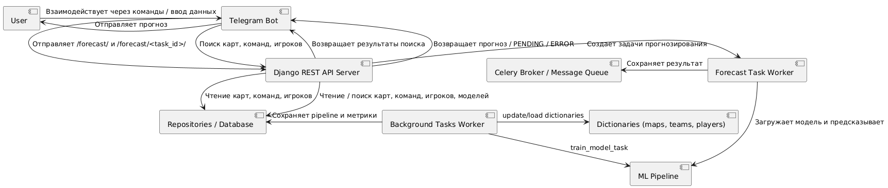

# CS2 Match Forecasting System

## Описание

Система предназначена для прогнозирования исходов матчей CS2 на основе данных о картах, командах и игроках.  
Пользователь взаимодействует через Telegram-бота, который отправляет запросы на сервер API.  
API сервер создаёт задачи прогнозирования, которые обрабатываются Celery воркерами с использованием обученной ML модели.  

Система также включает фоновую обработку данных и обучение модели:

- **Обновление словарей** (`maps`, `teams`, `players`) из сырых данных матчей.
- **Загрузка словарей** в базу данных.
- **Обучение ML модели** на исторических данных матчей.
- **Инференс прогноза** для новых матчей.

## Логика работы системы

1. **Пользователь через Telegram бот**:
    - Выбирает карту, команды и игроков.
    - Отправляет данные для прогноза через `/forecast/`.

2. **API сервер**:
    - Получает и валидирует данные.
    - Создаёт задачу прогнозирования и возвращает `task_id`.

3. **Celery Worker**:
    - Получает задачу из брокера.
    - Загружает последний ML pipeline.
    - Формирует признаки и предсказывает результат.
    - Сохраняет результат задачи.

4. **Результат пользователю**:
    - Telegram бот опрашивает API по `task_id`.
    - Получает прогноз (вероятности команд) или статус PENDING/ERROR.
    - Отправляет результат пользователю.

5. **Фоновые задачи**:
    - Обновление и загрузка словарей в базу данных.
    - Обучение ML модели на исторических данных матчей.
    - Сохранение метрик модели и pipeline.

## Архитектурная диаграмма компонентов

- **Telegram Interaction**: пользователь и бот.  
- **API Layer**: Django REST API и хэндлеры (`/maps/`, `/teams/`, `/players/`, `/forecast/`, `/forecast/<task_id>/`).  
- **Background Workers / Broker**: Celery брокер и воркеры.  
- **ML & Storage**: ML pipeline и база данных с репозиториями и словарями.

