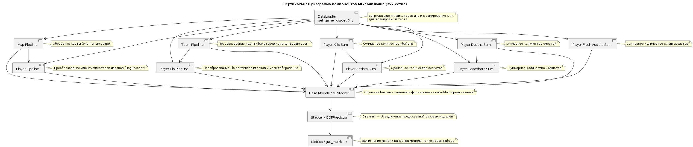

# Система предсказания исходов матчей

## Краткий обзор

Система обрабатывает данные о матчах, командах и игроках, запускает ML-модели для предсказаний и доставляет результаты пользователю в реальном времени.  
Используются: Django + DRF (REST), Django Channels (WebSocket), Celery (асинхронные задачи).

---

## Логика работы системы

1. **Постановка задачи**
   - Пользователь отправляет **POST-запрос** на `/predict/` с информацией о матче:
     - карты, команды, состав игроков.
   - `PredictHandler` проверяет данные через сериализатор и сохраняет запись предсказания в базе.
   - Система возвращает `prediction_id` и статус `inference_started`.

2. **Асинхронная обработка**
   - Задача на предсказание (`run_inference`) отправляется в очередь Celery.
   - Celery-воркер запускает ML-пайплайн:
     - загрузка данных,
     - извлечение признаков,
     - выполнение инференса модели,
     - сохранение результатов в БД и файлы метрик.

3. **Доставка результатов**
   - Клиент подписывается на WebSocket `/ws/predictions/`.
   - Когда ML-предсказание готово, система отправляет сообщение по WebSocket с:
     - статусом выполнения,
     - результатами предсказания (вероятности победы команд),
     - дополнительной аналитикой, если доступна.

4. **Отслеживание статуса**
   - Клиент может в любое время получить статус задачи через WebSocket, не делая повторных REST-запросов.
   - Система автоматически информирует о готовности результатов.

5. **Периодические задачи**
   - Словари команд, игроков и карт обновляются автоматически по расписанию.
   - ML-пайплайн запускается регулярно для переобучения модели и обновления метрик.

---

## Диаграмма потока работы


---

## Диаграмма мл пайплайна



---

## Основные преимущества

- REST API используется только для постановки задач.
- WebSocket обеспечивает мгновенную доставку результатов.
- Асинхронные задачи Celery повышают отзывчивость и масштабируемость.
- Периодические задачи поддерживают актуальность данных и моделей.
- Чёткое разделение слоёв: API → бизнес-логика → хранилище → ML-ядро.

---

## Структура проекта

```
.
├── app/                                   # Основное Django-приложение
│   ├── admin/                             # Админ-интерфейсы
│   │   ├── __init__.py                    # Делает директорию пакетом Python
│   │   ├── map.py                         # Админка для модели Map
│   │   ├── ml_forecast.py                 # Админка для ML Forecast модели
│   │   ├── ml_pipeline_metrics.py         # Админка для метрик ML пайплайна
│   │   ├── ml_pipeline.py                 # Админка для ML пайплайна
│   │   ├── player.py                       # Админка для модели Player
│   │   └── team.py                         # Админка для модели Team
│
│   ├── apps.py                            # Конфигурация Django приложения
│
│   ├── consumers/                         # WebSocket consumers для Channels
│   │   ├── __init__.py                    # Делает директорию пакетом
│   │   ├── forecast.py                     # Consumer для прогнозов (WebSocket)
│   │   └── forecast_test.py                # Тесты для forecast consumer
│
│   ├── handlers/                          # Обработчики событий или задач
│   │   ├── __init__.py                    # Делает директорию пакетом
│   │   ├── forecast.py                     # Обработчик логики прогнозов
│   │   └── forecast_test.py                # Тесты для обработчика forecast
│
│   ├── middlewares/                        # Кастомные Django middleware
│   │   ├── __init__.py                    # Делает директорию пакетом
│   │   ├── logging.py                      # Middleware для логирования запросов
│   │   └── logging_test.py                 # Тесты для logging middleware
│
│   ├── migrations/                         # Миграции базы данных
│   │   ├── __init__.py                     # Делает директорию пакетом
│   │   └── 0001_initial.py                 # Первая миграция (создание таблиц)
│
│   ├── ml/                                 # ML пайплайн
│   │   ├── __init__.py                     # Делает директорию пакетом
│   │   ├── data_loader.py                  # Загрузка и подготовка данных
│   │   ├── data_loader_test.py             # Тесты для data_loader
│   │   ├── feature_extractors.py           # Извлечение признаков
│   │   ├── feature_extractors_test.py      # Тесты для feature_extractors
│   │   ├── metrics.py                       # Вычисление метрик ML моделей
│   │   ├── metrics_test.py                  # Тесты для metrics
│   │   ├── stacker.py                       # Стекер моделей (ансамблирование)
│   │   ├── stacker_test.py                  # Тесты для stacker
│   │   ├── train_model.py                   # Обучение модели
│   │   └── ml.puml                           # Диаграмма пайплайна ML
│
│   ├── models/                             # Django модели
│   │   ├── __init__.py                     # Делает директорию пакетом
│   │   ├── map.py                           # Модель Map
│   │   ├── ml_forecast.py                   # Модель ML Forecast
│   │   ├── ml_pipeline_metrics.py           # Модель метрик ML пайплайна
│   │   ├── ml_pipeline.py                   # Модель ML пайплайна
│   │   ├── player.py                         # Модель Player
│   │   └── team.py                           # Модель Team
│
│   ├── repositories/                        # Data Access Layer
│   │   ├── __init__.py                     # Делает директорию пакетом
│   │   ├── map.py                           # CRUD для модели Map
│   │   ├── map_test.py                       # Тесты для map repository
│   │   ├── ml_forecast.py                   # CRUD для ML Forecast модели
│   │   ├── ml_forecast_test.py              # Тесты для ml_forecast repository
│   │   ├── ml_pipeline_metrics.py           # CRUD для метрик ML пайплайна
│   │   ├── ml_pipeline_metrics_test.py      # Тесты для ml_pipeline_metrics repository
│   │   ├── ml_pipeline.py                   # CRUD для ML пайплайна
│   │   ├── ml_pipeline_test.py              # Тесты для ml_pipeline repository
│   │   ├── player.py                         # CRUD для Player
│   │   ├── player_test.py                    # Тесты для player repository
│   │   ├── team.py                           # CRUD для Team
│   │   └── team_test.py                      # Тесты для team repository
│
│   ├── tasks/                               # Celery задачи
│   │   ├── __init__.py                     # Делает директорию пакетом
│   │   ├── fill_dictionaries.py             # Задача заполнения справочников
│   │   ├── fill_dictionaries_test.py        # Тесты для fill_dictionaries
│   │   ├── ml_pipeline.py                   # Асинхронный ML пайплайн
│   │   ├── ml_pipeline_inference.py         # ML inference задача
│   │   └── ml_pipeline_test.py              # Тесты для ml_pipeline tasks
│
├── config/                                 # Конфигурация Django проекта
│   ├── __init__.py                         # Делает директорию пакетом
│   ├── asgi.py                              # ASGI конфигурация (WebSockets)
│   ├── celery.py                            # Настройка Celery
│   ├── settings.py                          # Настройки Django
│   ├── urls.py                              # URL маршрутизация
│   └── wsgi.py                              # WSGI конфигурация
│
├── docker-compose.yml                        # Docker Compose конфигурация для сервисов
├── example.env                               # Пример файла переменных окружения
├── fluentd/                                  # Fluentd логирование
│   ├── conf/fluent.conf                      # Конфигурационный файл Fluentd
│   └── log/                                  # Папка для логов Fluentd
├── Makefile                                  # Команды для запуска, миграций и тестов
├── manage.py                                 # Django CLI скрипт
├── poetry.lock                               # Фиксированные версии зависимостей Poetry
├── pyproject.toml                            # Конфигурация Poetry и зависимостей проекта
├── README.md                                 # Документация проекта
├── user_usecase.png                           # PNG диаграмма пользовательских сценариев
└── user_usecase.puml                          # PlantUML диаграмма пользовательских сценариев
```

---
